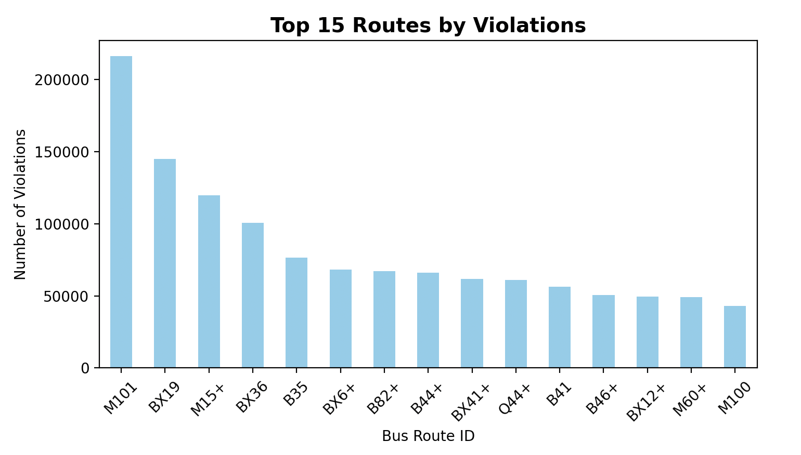
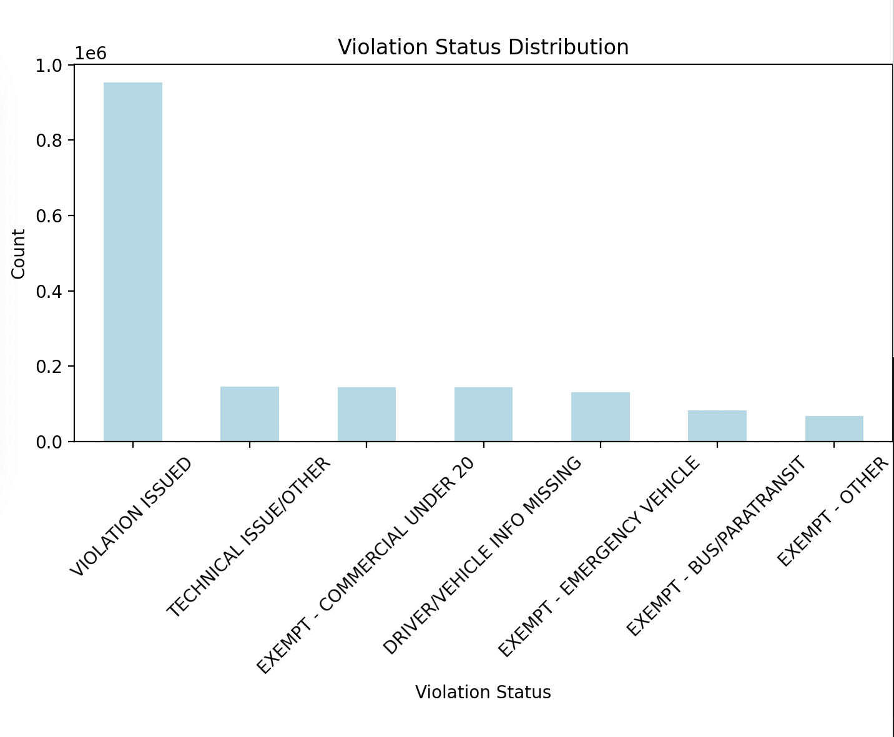

<section>
  <h1>MTA Bus ACE Enforcement Analysis: Multi-Year Policy Effectiveness Study</h1>
  
<strong>CUNY Datathon 2025 - Final Submission</strong> 
  Team: Sneha Roy, Alvin Zeng, Rey Reyes, Jeremy Khusial 
  Submission Date: September 24, 2025 
  Datasets: Combined 2024–2025 MTA Bus Automated Camera Enforcement Violations

  <h2>Project Video Explanation</h2>
  
[Embed video link]

  
The video demonstrates our key findings: M101 route deterioration, congestion pricing success, and policy recommendations based on our two-year comparative analysis.

  <h2>Summary</h2>
  
Our comparative analysis of NYC bus lane violations across 2024–2025 reveals critical insights into the effectiveness of the Automated Camera Enforcement (ACE) program. By analyzing more than 2 million violations, we found enforcement-only approaches show declining effectiveness while comprehensive policy interventions achieve dramatic results.

  <h2>Major Discoveries</h2>

  

    
  

  
  <ul>
    <li><strong>ACE Program Multi-Metric Failure:</strong> Camera-enforced routes show a 6% speed decline (8.6 → 8.1 MPH) and persistent high violation rates.</li>
    <li><strong>Policy Intervention Success:</strong> Congestion pricing achieved a 75% violation reduction in the Manhattan CBD area.</li>
    <li><strong>Systematic Enforcement Gaps:</strong> 425,814 exempt violations with 43,170 repeat offenders indicate persistent abuse patterns.</li>
  </ul>

  <h2>Multi-Year Analytical Approach</h2>

  <h3>Dataset Composition</h3>
  <ul>
    <li><strong>2024 Data:</strong> Full calendar year violation records</li>
    <li><strong>2025 Data:</strong> January 1 – August 21, 2025</li>
    <li><strong>Total Volume:</strong> 2+ million violations analyzed</li>
    <li><strong>Geographic Scope:</strong> All five NYC boroughs</li>
  </ul>

  <h3>Year-Over-Year Comparison Framework</h3>
  
This temporal analysis enables assessment of ACE program effectiveness over time and reveals whether camera enforcement alone creates sustainable behavioral change.

  <h2>Technical Implementation</h2>

  <h3>Multi-Year Data Processing</h3>
  <ul>
    <li><strong>2024 Dataset:</strong> Full year violation records (friend's analysis)</li>
    <li><strong>2025 Dataset:</strong> 1,667,477 rows processed with a 3.7-second load time</li>
    <li><strong>Temporal Alignment:</strong> Standardized date formats and geographic coordinates</li>
    <li><strong>Projection Methodology:</strong> Linear annualization with seasonal adjustment considerations</li>
  </ul>

  <h3>Analytical Tools</h3>
  <ul>
    <li><strong>Platform:</strong> Kaggle Notebooks for reproducible analysis</li>
    <li><strong>Geospatial Analysis:</strong> Folium interactive mapping with multi-layer visualization</li>
    <li><strong>Statistical Processing:</strong> Year-over-year growth calculations and trend analysis</li>
    <li><strong>Visualization:</strong> Three interactive HTML maps plus temporal comparison charts</li>
  </ul>

  <h2>Business Questions & Findings</h2>

  <h3>Question 1: Which routes serve CUNY students and how have bus speeds changed on ACE routes over time?</h3>
  
Supporting map: <code>/assets/cuny_routes_analysis.html</code>

  

  
  

  
<strong>Critical finding:</strong> ACE program shows declining performance across multiple metrics.

  
<strong>Speed analysis (2023–2024):</strong> Camera-enforced routes experienced an average speed decline from 8.6 MPH to 8.1 MPH (6% reduction). Persistent low speeds (8.1 MPH average) indicate continued lane blockage issues.

  
<strong>Violation pattern analysis — M101 route (primary CUNY corridor):</strong>

  <ul>
    <li>2024: 312,466 violations</li>
    <li>2025: 216,155 violations (Jan–Aug)</li>
  </ul>
  
Combined evidence (declining speeds and persistent high violation counts) demonstrates ACE cameras are failing to achieve their primary objectives on student-serving routes.

  <h3>Question 2: Are there repeat offenders among exempt vehicles? Where do violations occur?</h3>
  
Supporting map: <code>/assets/exempt_violations_hotspots.html</code>

  

  
  

  
<strong>Key findings (2025 data):</strong>

  <ul>
    <li>425,814 exempt violations (25.5% of total dataset)</li>
    <li>43,170 vehicles with multiple exempt violations</li>
    <li>Worst offender recorded 1,005 exempt violations</li>
  </ul>
  
Geographic hotspots show concentrated abuse patterns and indicate the exemption system enables systematic avoidance of accountability.

  <h3>Question 3: Congestion Pricing vs. ACE Enforcement Effectiveness</h3>
  
Supporting map: <code>/assets/congestion_pricing_fixed.html</code>

  

  
  

  
<strong>Dramatic policy contrast:</strong>

  <ul>
    <li><strong>Congestion Pricing:</strong> 75% violation reduction in Manhattan CBD. Before Jan 5, 2025: ~8,000 violations/day. After Jan 5, 2025: ~2,000 violations/day.</li>
    <li><strong>ACE Enforcement (camera-only):</strong> Multi-metric failure — 6% speed decline (8.6 → 8.1 MPH) and persistent high violation rates (M101: 300k+ annually).</li>
  </ul>
  
Strategic insight: Comprehensive policy interventions dramatically outperform enforcement-only approaches.

  <h2>Interactive Visualizations</h2>
  
Primary analysis resources (also in <code>/assets</code>):

  <ul>
    <li>Kaggle Notebook: Complete interactive analysis (multi-year dataset processing and comparison)</li>
    <li>Interactive maps for all business questions (HTML files in the <code>/assets</code> folder)</li>
    <li>Statistical modeling and temporal trend analysis</li>
  </ul>

  <h2>Policy Recommendations</h2>
  <h3>Immediate Actions Required</h3>
  <h4>For Student Transportation Equity</h4>
  <ul>
    <li>M101 route redesign: physical infrastructure improvements beyond camera enforcement</li>
    <li>Dedicated protected bus lanes on high-violation CUNY corridors</li>
    <li>Service frequency increases to reduce overcrowding and lane violations</li>
  </ul>

  <h4>For Enforcement System Reform</h4>

  

    
  

  <ul>
    <li>Exemption process overhaul: stricter approval and monitoring for repeat exempt vehicles</li>
    <li>Geographic targeting: focus enforcement resources on identified hotspot areas</li>
    <li>Escalating penalties: progressive fines for chronic violators</li>
  </ul>

  <h4>For Policy Development Strategy</h4>
  <ul>
    <li>Expand successful models: apply congestion pricing approach to other high-violation corridors</li>
    <li>Prioritize comprehensive policy interventions over enforcement-only solutions</li>
    <li>Adopt data-driven iteration and continuous monitoring</li>
  </ul>

  <h2>Methodology & Limitations</h2>
  <h3>Analytical Strengths</h3>
  <ul>
    <li>Multi-year comparison enabling trend and effectiveness assessment</li>
    <li>Large sample size (2+ million violations) offering statistical significance</li>
    <li>Geographic visualization identifying spatial patterns for targeted intervention</li>
  </ul>

  <h3>Acknowledged Limitations</h3>
  <ul>
    <li>Speed measurement requires additional MTA operational timing data for direct speed analysis</li>
    <li>Seasonal variation: full-year 2025 data would strengthen projections</li>
    <li>External factors such as economic conditions and ridership changes may influence violation patterns</li>
  </ul>

  <h2>Conclusion</h2>
  
The ACE program shows mixed effectiveness depending on intervention type. While congestion pricing achieves dramatic reductions in violations (75%), enforcement-only approaches on high-utilization routes show declining effectiveness. These findings have implications for transportation equity and resource allocation. Next steps include integrating MTA operational data for comprehensive speed analysis, expanding route types, and developing predictive models for intervention effectiveness.

 <h2>Repository Structure</h2>
<pre><code>
README.md (this file)
assets/
  cuny_routes_analysis.html
  exempt_violations_hotspots.html
  congestion_pricing_fixed.html
  bus_speed_trends.jpeg
  m15_m101_routes.jpeg
  bus_routes_by_violation.jpeg
  congestion_pricing_violation.jpeg
  top_cuny_routes.jpeg
  violation_status_distribution.jpeg
  cuny_vs_non_cuny_route_violation.jpeg
analysis/
  2024_analysis_methods.ipynb
  2025_data_processing.py
  kaggle_interactive_mapping_analysis.ipynb
docs/
  index.html
  cuny_routes_analysis.html
  exempt_violations_hotspots.html
  congestion_pricing_fixed.html
  bus_speed_trends.jpeg
  m15_m101_routes.jpeg
  bus_routes_by_violation.jpeg
  congestion_pricing_violation.jpeg
  top_cuny_routes.jpeg
  violation_status_distribution.jpeg
  cuny_vs_non_cuny_route_violation.jpeg
</code></pre>

</section>

